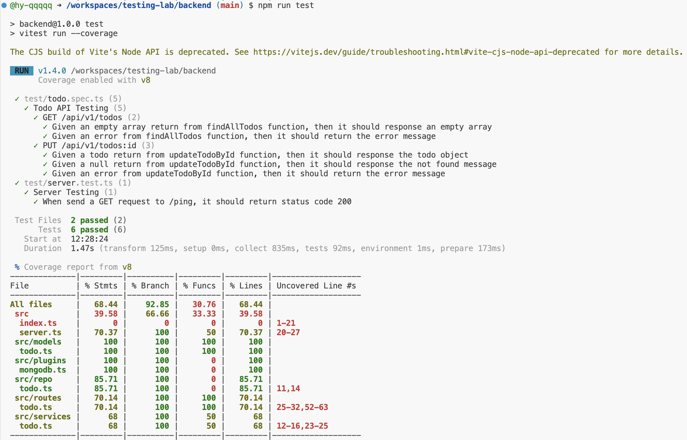

# Cloud Native Homework 2

> 312551032 彭暄宇

- Backend language: `TypeScript`
- Frontend language: `React`

## Testcase 1 (Backend)

### Description

> [!NOTE]
> Test name: Todo API Testing: `PUT /api/v1/todos:id` Given a todo return from updateTodoById function, then it should response the todo object.
> In this test, I've tested the three branches of this API. And choose one of them as the example testcase for this report.

- Testing tool: `vitest` framework
- Testing strategy:
    - *Scenario*: Mock the `updateTodoById` function in `repo/todo.ts`, so that it always return the given todo object.
    - *Target*: The API `/api/v1/todos:id` with `PUT` method.
    - *Expectation*: The API should response the same todo object as what we given int the scenario.

### Analysis

`routes/todo.ts`
```js
server.put<{ Params: IdParam; Body: StatusBody }>('/v1/todos/:id', opts, async (request, reply) => {
  try {
    const id = request.params.id
    const status = request.body.status
    const todo = await updateTodoStatus(id, status)
    if (todo) {
      return reply.status(200).send({ todo })
    } else {
      return reply.status(404).send({ msg: `Not Found Todo:${id}` })
    }
  } catch (error) {
    server.log.error(`PUT /v1/todos/${request.params.id} Error: ${error}`)
    return reply.status(500).send(`[Server Error]: ${error}`)
  }
})
```

這段程式碼總共有三個分支
- `try -> if`
    當 `updateTodoStatus` 回應是 Resolved 且 `todo` 非 `null`
- `try -> else`
    當 `updateTodoStatus` 回應是 Resolved 且 `todo` 是 `null`
- `catch`
    當 `updateTodoStatus` 回應是 Rejected

這三種情況都有各自的 status code 以及對應的 response 內容，因此以此作為測試的方向。

### Implementation

```js
describe('Todo API Testing', () => {
  const server = serverOf()

  afterEach(() => {
    vi.resetAllMocks()
  })

  ...

  describe('PUT /api/v1/todos:id', () => {
    const id = '0'
    const payload = {
      status: true
    }
    const acc_todo: Todo = {
      id: id,
      name: 'test',
      description: '',
      status: true
    }

    test('Given a todo return from updateTodoById function, then it should response the todo object', async () => {
      // arrange: stub the repo function to return
      vi.spyOn(TodoRepo, 'updateTodoById').mockImplementation(async (id, { status: newStatus }) => acc_todo)

      // act: send a PUT request to /api/v1/todos:id
      const response = await server.inject({
        method: 'PUT',
        url: '/api/v1/todos/' + id,
        payload: payload
      })

      // assert: response should be the todo object
      expect(response.statusCode).toBe(200)
      const todo = JSON.parse(response.body)['todo']
      expect(todo).toStrictEqual(acc_todo)
    })
  })
})
```

### Result



## Testcase 2 (Frontend)

### Description
- Testing tool: `cypress` framework
- Testing target
- Testing strategy

### Implementation

### Result


撰寫兩個 test cases (Backend 或 Frontend 不限)，並附上該測試的說明報告

    附上程式碼片段
    測試報告(截圖)
    說明
        描述前端或後端的測試
        使用的測試工具
        測試策略 (如測試場景、測試主體、預期結果等)
