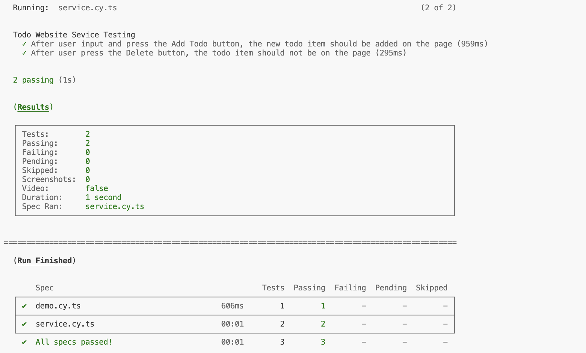

# Cloud Native Homework 2

> 312551032 彭暄宇

Testing Lab
- Backend language: `TypeScript`
- Frontend language: `React`

## Testcase 1 (Backend)

### Description

> [!NOTE]
> Test name: Todo API Testing: `PUT /api/v1/todos:id` Given a todo return from updateTodoById function, then it should response the todo object.
> In this test, I've tested the three branches of this API. And choose one of them as the example testcase for this report.

- Testing tool: `vitest` framework
- Testing method: Unit testing
- Testing strategy:
    - *Scenario*: Mock the `updateTodoById` function in `repo/todo.ts`, so that it always return the given todo object.
    - *Target*: The API `/api/v1/todos:id` with `PUT` method.
    - *Expectation*: The API should response the same todo object as what we given int the scenario.

### Analysis

`routes/todo.ts`
```js
server.put<{ Params: IdParam; Body: StatusBody }>('/v1/todos/:id', opts, async (request, reply) => {
  try {
    const id = request.params.id
    const status = request.body.status
    const todo = await updateTodoStatus(id, status)
    if (todo) {
      return reply.status(200).send({ todo })
    } else {
      return reply.status(404).send({ msg: `Not Found Todo:${id}` })
    }
  } catch (error) {
    server.log.error(`PUT /v1/todos/${request.params.id} Error: ${error}`)
    return reply.status(500).send(`[Server Error]: ${error}`)
  }
})
```

這段程式碼總共有三個分支
- `try -> if`
    當 `updateTodoStatus` 回應是 Resolved 且 `todo` 非 `null`
- `try -> else`
    當 `updateTodoStatus` 回應是 Resolved 且 `todo` 是 `null`
- `catch`
    當 `updateTodoStatus` 回應是 Rejected

這三種情況都有各自的 status code 以及對應的 response 內容，因此以此作為測試的方向。

### Implementation

```js
describe('Todo API Testing', () => {
  const server = serverOf()

  afterEach(() => {
    vi.resetAllMocks()
  })

  ...

  describe('PUT /api/v1/todos:id', () => {
    const id = '0'
    const payload = {
      status: true
    }
    const acc_todo: Todo = {
      id: id,
      name: 'test',
      description: '',
      status: true
    }

    test('Given a todo return from updateTodoById function, then it should response the todo object', async () => {
      // arrange: stub the repo function to return
      vi.spyOn(TodoRepo, 'updateTodoById').mockImplementation(async (id, { status: newStatus }) => acc_todo)

      // act: send a PUT request to /api/v1/todos:id
      const response = await server.inject({
        method: 'PUT',
        url: '/api/v1/todos/' + id,
        payload: payload
      })

      // assert: response should be the todo object
      expect(response.statusCode).toBe(200)
      const todo = JSON.parse(response.body)['todo']
      expect(todo).toStrictEqual(acc_todo)
    })
  })
})
```

### Result


可以看到 `src/routes/todo.ts` 中的 35~49 行 (PUT API) 已被測試 cover 到

## Testcase 2 (Frontend)

### Description

> [!NOTE]
> Test name: Todo Website Sevice Testing. After user input and press the Add Todo button, the new todo item should be added on the page.
> This test aims to test the functionality of the Add Todo button.

- Testing tool: `cypress` framework
- Testing method: End-to-end testing
- Testing strategy:
    - *Scenario*:
      - The user has input the name and description of todo item.
      - The user then pressed the Add Todo button.
    - *Target*: Add Todo button functionality.
    - *Expectation*: The new todo item should be added on the page.

### Analysis


Todo website 中使用者可以看到幾個按鈕 (功能)
- `Add Todo` button: 新增一個 todo item
- `Complete` button: 完成一個 todo item
- `Delete` button: 刪除一個 todo item

在這個測試主要針對 `Add Todo` 的功能做測試，當使用者在 `Name` `Description` 兩個欄位輸入內容，並且按下 `Add Todo` 按鈕。新增的 todo item 會顯示在下方的清單之中。
例如：圖中的 item 會有以下 elements，可以將這些做為 Expectation:
- name
- description
- `Complete` button
- `Delete` button

### Implementation

`service.cy.ts`
```js
describe('Todo Website Sevice Testing', () => {
  const todo_name = 'test'
  const todo_desc = '1234'

  it('After user input and press the Add Todo button, the new todo item should be added on the page', () => {
    // arrange
    cy.visit('/')

    // act
    cy.get('#name').type(todo_name)
    cy.get('#description').type(todo_desc)
    cy.get('.Form > button').click()

    // assert
    cy.get('.Card').contains(todo_name)
  })
})
```

### Result


